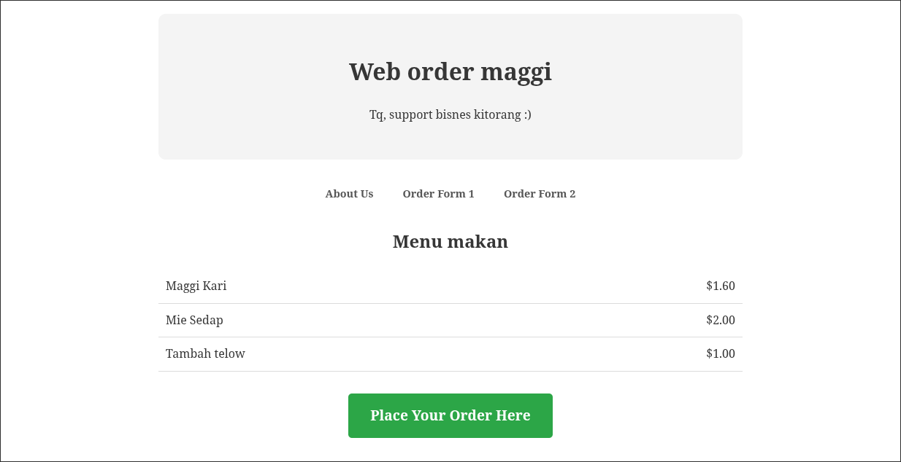

<p align="center">
  
</p>

hello muzamil, ni note simple aq letak kt sini utk first time read shj

kalau ko niat nk tolong aq please habiskan README.md ni

github
---
kita bole guna dua OS, untuk windows solusi dia pakai ni ja.

https://gitforwindows.org
> **TL;DR** mudahnya untuk kasi terminal command kita familiar dengan eachother (linux/windows)(bash/shell),

> so kalau pakai ni dah tk risau la lain command dgn aq

Cloning
---

sblm, contribute anything kt web ni mesti la kene ada source code dya

`git clone <your-repo-url>` for example `git clone https://github.com/soffoulant2/website-teragung.git`
> **fyi**, command ni akan copy repo aq dlm current directory so make sure ko ada sedia kan folder khas utk project nie

Git command (pull,add,commit,push)
---
ni mmg workflow github utk fetch latest update (pull), untuk pilih folder specific apa yg nak diamik (add),
labelling apa yang diubah (commit) and lastly, lepas ko da settle adjust, send kt github server ke repo aq (push)

```bash
git pull origin main
git add .
git commit -m "brief description"
git push origin main
```
`git pull origin main` setiap perkataan tu mmg ad function tersendiri, git tu command yg akan digunakan astu
pull tu utk fetch latest update drpd repo aq, meaning ap yg aq ad edit dlm tu ko bole amik jugak la then origin main tu cabang repo aq (buat masa ni tkda lakot)

`git add .` git tu da tau ap, add tu untuk pilih spesifik ap yg ko nak amik drpd repo aq, e.g titik tu maksud dia ko nk amik semua update drpd repo aq, `git add index.html` kalo selain titik ko bole arahkan nak amik satu folder spesifik sahaja

`git commit -m "please la explain btul2 dlm ni"` ni untuk ko creates permanent history point, maksudnya perubahan yang ko nak saves and labelling ap yg diubah drpd setiap history point.
> commit => creates permanent history point; catatan adjustment ko

> -m flag mesej maksud dia, dlm quote tu dia suh letak brief explanation/mesej pasai pa yg ko pernah edit sblm ni

`git push origin main` tempat mana ko amik, tempat situ jugak la ko update balik

Editing
---
ko bole edit pakai apa2 IDE or text editor `e.g notepad++, kate, VSCodium`

browser, chromium-based ke mozilla-based ke asal browser bole load.

yg penting pandai simpan n hantar kat repo

Hosting
---
skrg ko da pandai navigate through ko punye files, github repo kie, etc da cukup memadai untuk continue kpd next-level stress-free... Hosting.

utk hosting, ada byk cara hosting yg kita bole wat, for this case aq akan tunjuk hanya dua cara yang reliable sahaja.

# Github Pages
sangat2 straightfoward, public-accessible, github/user-friendly.

cukup kreteria hosting, perfect 👍

# Local-Hosting
sebab2 tertentu je menggunakan local-hosting method ni
* untuk monitor logs, sape masuk, adjustment ap yg diorang wat, and mengintai password ap yg diorang letak dlm web ko 😁

### Cloudflared + Python

```bash
cd ~/Your-Destinated-Project-Directory
python3 -m http.server 8000
```

pasang terminal baru

```bash
cloudflared tunnel --url http://localhost:8000
```

Miscellaneous
---

Hiearchy Folder Web-Maggi (MAY2026)
```text
maggi-webfun/
├── index.html       <-- index html
├── form.html        <-- link 1
├── form2.html       <-- link 2
├── about.html       <-- link about
├── README.md        <-- tau lah kan yg mana ni
├── .gitignore       <-- tkyh tau tkpe
└── test/            <-- tempat practice
